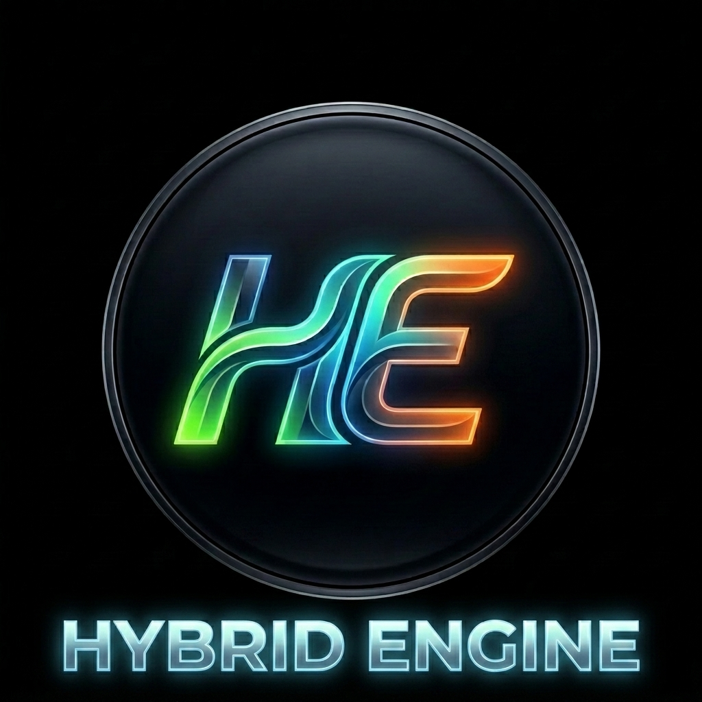
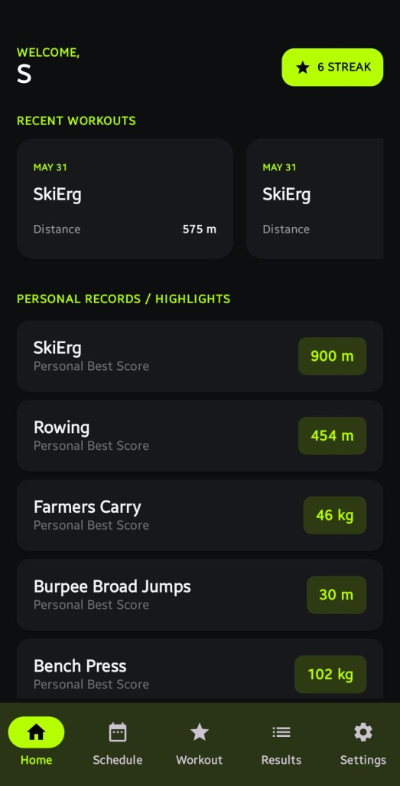
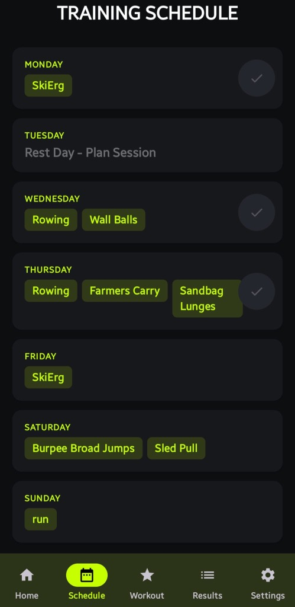
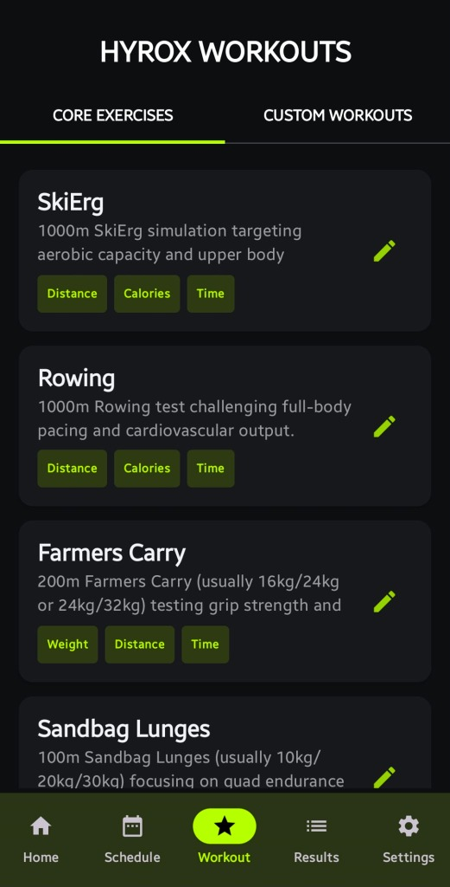
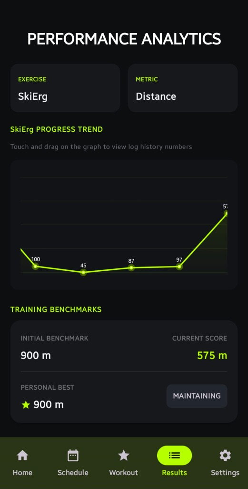

# ⚡ Hybrid Engine



**Hybrid Engine** is a premium, high-performance training companion application built for hybrid athletes competing in **Hyrox, CrossFit, F45, Triathlons**, and functional fitness. It combines a local-first offline database with real-time cloud synchronization to log workouts, track performance metrics, and schedule weekly routines seamlessly.

---

## 📸 App Preview

| Dashboard | Weekly Schedule | Workouts List | Performance Trends |
| :---: | :---: | :---: | :---: |
|  |  |  |  |

---

## 🚀 Key Features

*   **⚡ Local-First Architecture**: Fully offline-capable database powered by a user-partitioned SQLite implementation (Schema Version 8) with zero performance delay.
*   **☁️ Automatic Background Sync**: Seamless bi-directional synchronization linking your local SQLite tables to secure **Firebase Cloud Firestore** collections.
*   **📅 Timezone-Aware Scheduling**: A dynamic 7-day schedule with automated weekly rollover resets (Monday at 00:00 local time) and future-day completion locks.
*   **📈 Horizontally Scrollable Analytics**: Custom interactive line charts that scroll smoothly for up to 100+ logs, featuring custom tooltip overlays.
*   **🔒 Complete User Isolation**: Compound primary keys ensure custom workouts, logs, and theme preferences (e.g., individual Light/Dark preferences) are completely partitioned per athlete on shared devices.
*   **🛡️ Athlete Profile Onboarding**: Safe registration with searchable country lists, dynamic optional states/provinces, and chronological Date-of-Birth input validation.
*   **⏳ Compliant 90-Day Account Deletion**: Soft-delete account retention that schedules data purging after 90 days of inactivity, with instant one-click restoration upon login.

---

## 🛠️ Tech Stack

*   **Language**: 100% Kotlin
*   **UI Framework**: Jetpack Compose (Material 3)
*   **Asynchrony**: Kotlin Coroutines & Flow
*   **Database**: User-Partitioned SQLite
*   **Backend Services**: Firebase Authentication & Cloud Firestore
*   **Dependency Injection / Versioning**: Gradle Version Catalogs (Kotlin DSL)

---

## 📂 Project Structure

```text
Hyrox-Training/
├── app/
│   ├── google-services.json.example  # Public configuration template
│   ├── src/main/java/com/example/hyroxtraining/
│   │   ├── data/
│   │   │   ├── Models.kt             # Data structures (Profile, Workout, Results)
│   │   │   ├── DatabaseHelper.kt     # SQLite queries, schema upgrades, migrations
│   │   │   └── FirebaseSyncHelper.kt # Bi-directional Firestore syncing engine
│   │   └── ui/
│   │       ├── auth/                 # Login, Onboarding, and Password recovery
│   │       ├── dashboard/            # Athlete welcome page
│   │       ├── results/              # Performance analytics & custom trends
│   │       └── schedule/             # Timezone-aware weekly planners
│   └── build.gradle.kts              # Module build script and signing configs
├── build.gradle.kts                  # Project build script
└── local.properties                  # Local environment parameters (Git ignored)
```

---

## 📄 License
This project is private and proprietary. All rights reserved.
